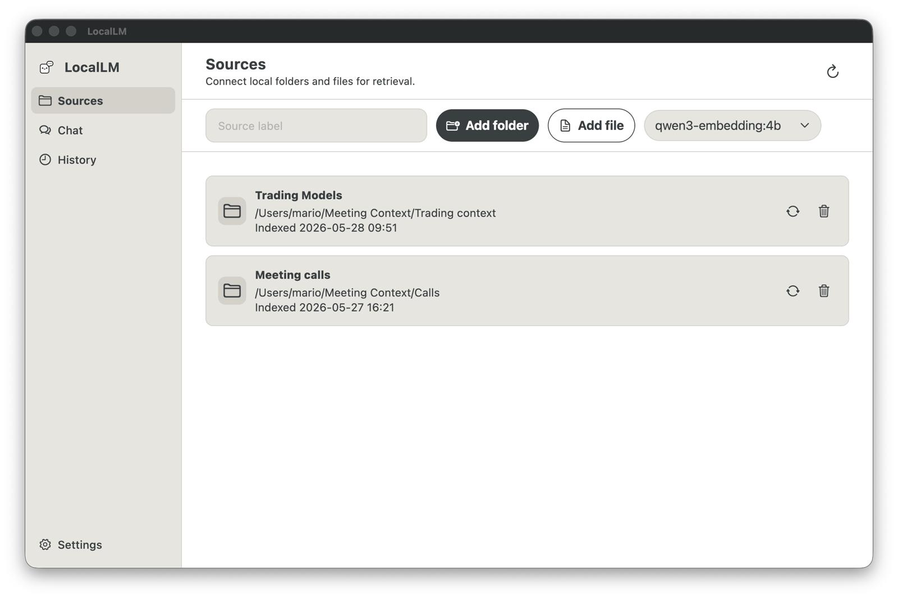
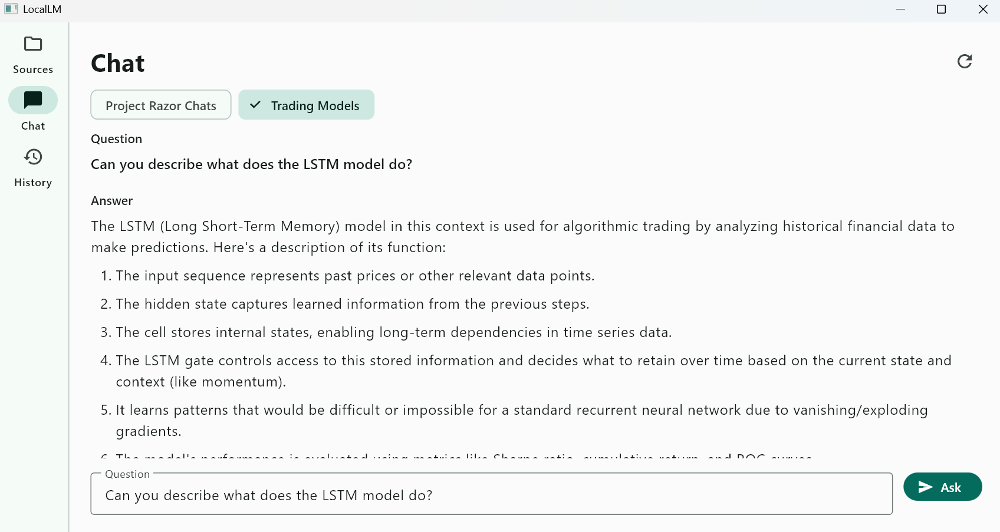
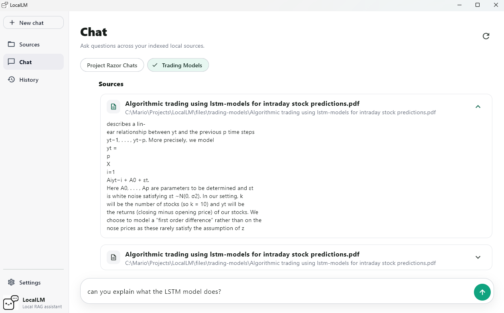
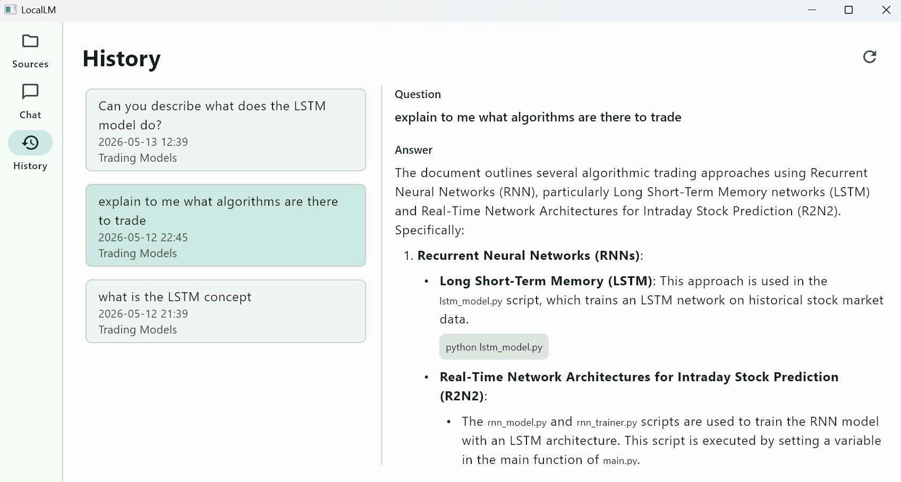

<p align="center">
  
</p>

<h1 align="center">LocalLM</h1>

<p align="center">
  A local-first Windows desktop app for asking questions over your own files and folders.
</p>

<p align="center">
  
  
  
  
  
</p>

<p align="center">
  <a href="#screenshots">Screenshots</a> |
  <a href="#features">Features</a> |
  <a href="#install-instructions">Install Instructions</a> |
  <a href="#quick-start">Quick Start</a> |
  <a href="#configuration">Configuration</a> |
  <a href="#api">API</a>
</p>

---

LocalLM indexes labelled local files, retrieves the most relevant chunks, and generates answers with local Ollama models. Your documents stay on your machine: the desktop app talks to a local FastAPI backend, which stores metadata in SQLite and embeddings in ChromaDB. The packaged Windows app stores this data under `%LOCALAPPDATA%\LocalLM\data`.

## Install Instructions

Open PowerShell and run:

```powershell
irm https://raw.githubusercontent.com/marioportillohernaiz/LocalLM/main/install.ps1 | iex
```

This installs the LocalLM Windows app and local backend. Models are not included in the app download; open LocalLM, go to Settings, and download the chat and embedding models you want to use.

## Screenshots

### 1. Add Sources

Add labelled folders or individual files, then index or re-index them locally.



### 2. Ask Questions

Select one or more source labels and ask questions against the indexed content.




### 3. Review History

Browse previous questions, answers, labels, and cited source material.



## Features

- Add local folders or individual `.txt`, `.md`, `.pdf`, and `.docx` files.
- Group sources with human-readable labels.
- Index documents locally into SQLite and ChromaDB.
- Ask questions against selected labels.
- Generate answers through a local Ollama model.
- Store and browse chat history.
- Configure the backend URL from the desktop app.

## Architecture

```text
Flutter Windows app
  -> Local FastAPI backend
      -> SQLite metadata and chat history
      -> ChromaDB document chunks and embeddings
      -> Ollama embeddings and answer generation
```

The desktop app handles source selection, labels, questions, and display. The Python backend owns file parsing, chunking, embedding, retrieval, history storage, and LLM calls.

## Quick Start

### Requirements

- Ollama installed and running: https://ollama.com/download
- Windows 10 or newer.

Install models from the LocalLM Settings screen after launching the app.

### Run From Source

These steps are only needed if you want to run the development version from this repository.

Requirements:

- Windows with Flutter desktop support enabled.
- Python 3.11 or newer.
- Ollama installed and running.

### Run The Backend

```powershell
cd backend
python -m venv .venv
.\.venv\Scripts\activate
pip install -r requirements.txt
python run.py
```

Check the API:

```powershell
curl http://127.0.0.1:8000/health
```

Expected response:

```json
{"status":"ok"}
```

### Run The Windows App

In a second terminal:

```powershell
cd app\flutter_windows_app
flutter pub get
flutter run -d windows
```

## Configuration

| Variable | Default | Purpose |
| --- | --- | --- |
| `LOCALLM_DATA_DIR` | Source: `backend/data`; packaged Windows app: `%LOCALAPPDATA%\LocalLM\data` | SQLite and ChromaDB storage location |
| `LOCALLM_LLM_MODEL` | `qwen2.5:1.5b` | Ollama model used for answers |
| `LOCALLM_EMBEDDING_MODEL` | `qwen3-embedding:0.6b` | Ollama model used for embeddings |
| `LOCALLM_CHUNK_SIZE_CHARS` | `3000` | Maximum chunk size before embedding |
| `LOCALLM_CHUNK_OVERLAP_CHARS` | `400` | Overlap between adjacent chunks |
| `LOCALLM_TOP_K` | `8` | Number of chunks retrieved for each question |

Example:

```powershell
$env:LOCALLM_LLM_MODEL = "qwen3:8b"
$env:LOCALLM_EMBEDDING_MODEL = "mxbai-embed-large"
python run.py
```

To keep source and packaged builds on the same data folder, set `LOCALLM_DATA_DIR` before starting the backend:

```powershell
$env:LOCALLM_DATA_DIR = "$env:LOCALAPPDATA\LocalLM\data"
python run.py
```

## API

| Method | Path | Description |
| --- | --- | --- |
| `GET` | `/health` | Backend health check |
| `GET` | `/sources` | List indexed sources |
| `POST` | `/sources` | Add a labelled file or folder |
| `POST` | `/sources/{source_id}/index` | Index or re-index a source |
| `POST` | `/chat/ask` | Ask a question against selected labels |
| `GET` | `/history` | List saved chat history |

## Repository Layout

```text
backend/                 FastAPI backend and local RAG services
app/flutter_windows_app/ Flutter Windows desktop client
docs/screenshots/        README logo and screenshots
files/                   Local sample files used during development
```

## Project Status

LocalLM is a working local RAG spike. It is intended to prove the usefulness of answering questions over labelled local folders before adding production packaging, background indexing, richer citations, or advanced retrieval features.
